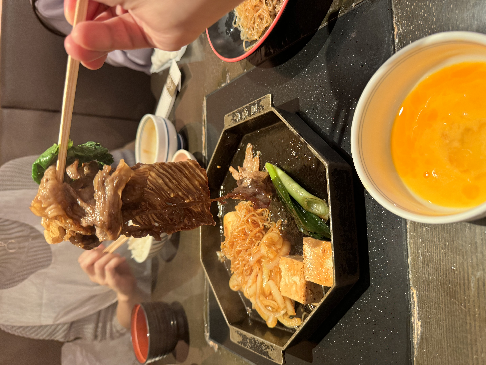
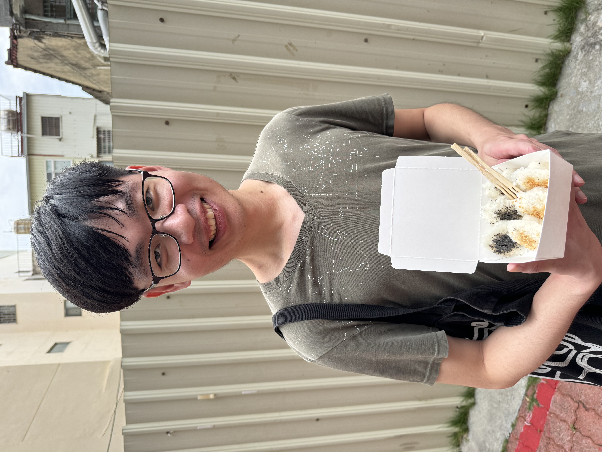

# Year End Review

## TL;DR

- Start working as Software Engineer, and soon moved from ViewSonic to Trend Micro
- 2 week trip to Japan, with my girlfriend
  
- Lost 12kg by 10 months of diet and exercise
- Baudoin came to Taiwan with his sister Astrid!
- Defend Taiwan's democracy

## Achievement:

- Reached out by Google, invited to interview
- Soon realized ViewSonic is not a good place to work(2nd month), left the company before it's too late
  
- Finally started to work as web developer(Trend Micro, golang and gin for backend)
- Rent a place in 中和 and survived

## Failed to do:

- Wrote any story
- 在蘇怡帆身邊幫他慶生
- Read Design Data Intensive Application(DDIA)

## 2025 Resolution:

- 在蘇怡帆身邊幫他慶生
- Find a Software Engineer job in London
- Read System Design Interview - An Insider's Guide by Alex Xu
- Read Design Data Intensive Application(DDIA)
- Start my investment plan
- Got AWS Certified Solution Architect Professional(SAP-C02)
- Backup copy for all my photos

## Entertainment:

- Spotify:
  
  
- Movies:
  - 名偵探柯南劇場版: 100 萬美元的五稜星
  - Poor thing(by Emma Stone)
- Series and Reality Shows:
  - 聽海湧: 透過三個在婆羅洲的台籍日本兵(新海三兄弟)的半虛構故事, 去補足我對男阿祖同時間在海南島可能經歷過的想像. 也透過這部台語歷史劇, 學一點我祖先的語言, 台語
  - 鹽水大飯店: 以美麗島事件中農民運動領袖戴振耀先生為藍本, 也是台語歷史劇, 但這部的台語太過北部, 中文化
  - 諾曼第大空降 Band of Brothers: HBO 經典之作, 二戰歐洲戰場
  - 頭號外交官 S2
  - 真愛挑日子 One Day(2024 fav) 哭暈
  - Baby reindeer
  - 歡迎來到三達里
  - 黑白大廚
  - 淚之女王
  - 少年歌行
- Books:
  - Les Justes by Albert Camus
- Manga and Anime:
  - 膽大黨
  - 葬送的福利蓮
  - 迷宮飯(漫畫完結)
  - 咒術迴戰(漫畫今年完結)
- 2024 Watched together with 蘇怡帆(Yvonne):
  - 老狐狸
  - Poor thing
  - Baby reindeer
  - Past lives
  - One day
    
  - 淚之女王
  - 少年歌行
  - Karina 綜藝
  - 聽海湧
  - 歡迎來到三達里
  - 黑白大廚

## External events:

- WBSC P12 World Baseball Classic: Team Taiwan, 我們擊敗國際賽 27 連勝的日本隊，拿下冠軍. 作為看球 15 年老球迷, 我在大阪哭到臉麻. 不會再有人說"那都是打假的有甚麼好看了?", 我看的是世界冠軍
  
  
- To protest against the constitutional crisis created by China's puppets in the congress, I went on the streets for 4 times
  
  
- President of South Korea, Mr. Yoon Suk Yeol, unilaterally declared martial law and soon impeached for this.
- Donald Trump re-elected as president of the United States.
  
- Inspired by Kpop fans in Korea, who protested against President Yoon declaring martial law, Kpop fans in Taiwan went on the streets with their hand lights(手燈), launched the campaign “我的本命是台灣”
- My favorite baseball team, 中信兄弟 CTBC Brothers, won 2024 season Championship
- My favorite NBA franchise, Boston Celtics, won 23-24 season Championship
- 2024 巴黎奧運, 王齊麟和李洋再次在奧運組成麟洋配, 達成史上第一次奧運羽球男雙連霸
  
- 2024 巴黎奧運, 林郁婷在由國際拳總(俄羅斯控制)製造的, 不存在的生理性別爭議中, 奪下金牌. 哈利波特作者 J.K. Rowling, 因為恐跨的情緒跟白人中心的審美, 在這起事件中成為國際拳總的幫兇
  
- 柯文哲, 2014 年趁著太陽花學運動能, 當選台北市長. 2024 年, 柯文哲在一堆弊案跟爭議中走下神壇, 同年底北檢起訴求刑 28.5 年
- 焦安溥跟吳慷仁, 即使曾經參與過太陽花學運, 也無法阻止他們在 2024 年, 迎合中國市場, 在 10/1 祝福中國生日快樂, 同時發表類似兩岸一家親的言論
- 大谷翔平, 在轉隊到道奇隊的第一年在球隊成就跟個人成就大豐收: 道奇贏得 2024 世界大賽冠軍 && 大谷本季僅以打者身分上場, 創下前無古人的 54 轟 59 盜, 贏得國聯 MVP
- 咒術迴戰一路電梯向下爛到底的完結了. 五條悟以人肉載具的方式被乙骨優太短暫復活

## Personal Events/ Trivia:

- 在大阪環球影城買了耀西的頭套，日本行的最佳購物之一
  
- 在日本行購入心心念念的 Aesop Tacit
- 京都百貨公司內的三嶋亭是我吃過最好吃的壽喜燒
  
- 喜歡名古屋甚麼都有但人少很多
- 我穿和服意外很適合, 很像什麼都不會的廢物少爺
  
- 到年末有四罐喜歡的香水: Aesop Tacit, 台灣小眾品牌 EyeCandle Religious Cedar, 日本小眾品牌 Aux Paradis 的 Winter Berry, 來自韓國 OneWood(Le Labo The Noir 平替)
- 隨著年華老去, 每天出門前都會擦有潤色效果的防曬乳
- Ruined my old Samsung phone when I was doing squat. Start using IPhone
- Lose 12kg(80->68) by 10 months of diet
- Volunteered in Pride Parade. Some heterosexual old men pointed at my nose and called me selfish because I rejected their vehicles ran into the crowd.
- My only friend from grade school, Baudoin, came to Taiwan with his sister Astrid! They spent 10 days in Taiwan. We celebrated my 27th birthday in Taipei.
  
- 上半年去台南探訪陳毅, 順便去玩
  
- Oct/26 六魯重聚, 在宜蘭包棟兩天一夜
  
- Dec/31-2025/Jan/01 阿里山跨年團, 老白主揪
  
- 洪翊閔爸爸身體微恙, 他一邊穩定家裡一邊照顧我的右肩, 也持續加強物理治療專業
  
- 彭紹宇完成第二本書大綱
  
- 郭宸輔&&陳儀珈今年三月完成婚禮, 同年十月生下第一個寶寶
- 黃大謙出第二張專輯, 大受好評. "我過得好嗎?"獲得高討論度

## Names of People I met:

- 王靖婷: 蘇怡帆的朋友
- 陳致源: 蘇怡帆的朋友
- Astrid: Baudoin's sister
- Al Tsai: ex-ViewSonic colleague
- Lyndon Lu: ex-ViewSonic colleague
- Brian Chien: ex-ViewSonic colleague/ Trend Micro colleague(but worked for different department)
- Alex Yeh: Trend Micro colleague, contractor.
- Jim Lin: Trend Micro colleague
- Arthur Li: Trend Micro colleague
- Danny Du: Trend Micro colleague, Tech Lead
- Neil xx: Trend Micro colleague, Team Lead
- James Ho: Trend Micro colleague, a newbie just like me

## Question to keep in mind:

A colleague of mine, we met in the office after working hours. He didn't know i was prepping for Google Interviews. I told him I was studying for AWS certifications and working on some other side projects. He was not surprised at all. He always said I deserved places way better than the current company, even though only a handful of software companies are better than the current one.

Then we talked about working out, and shared the numbers we could do in gym. He told me that, based on my muscular-ish appearance, I could totally push myself harder. I knew I could do better at work and in gym, but I was, in a way, satisfied then.

After that night, I start to think maybe I actually underestimated myself?

This story seeded in my brain and becomes the question to keep in mind:
**Am I underestimating myself?**
