# 2025 1st Half review

## TL; DR

- passed all Google interviews, waiting to get team matched

- Vaish and Lux’s Tamil wedding in Toronto
  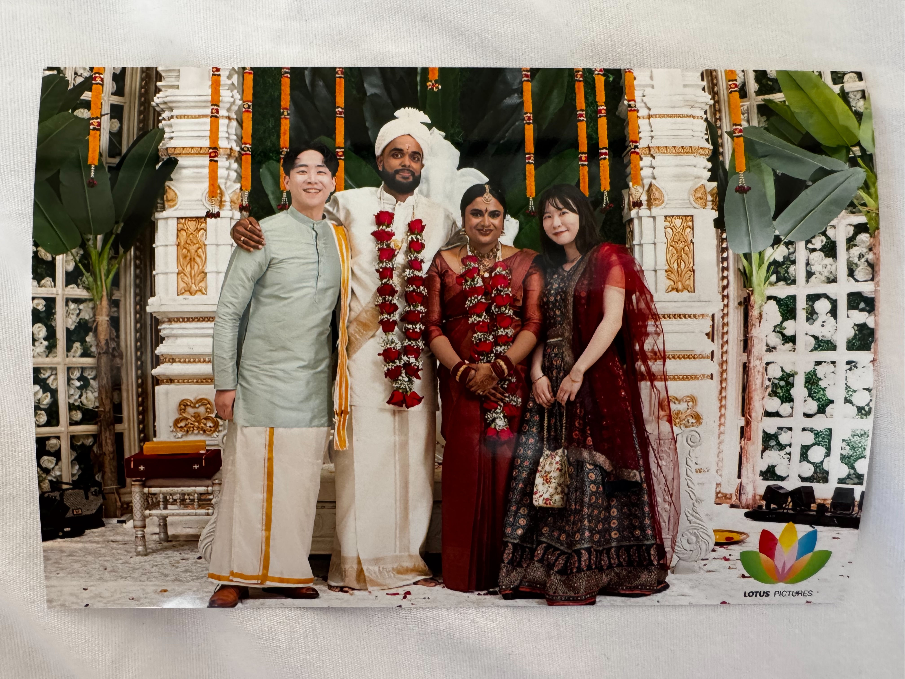

- Attended Yi-Fan’s favorite KPOP idol — Taeyeon’s concert
  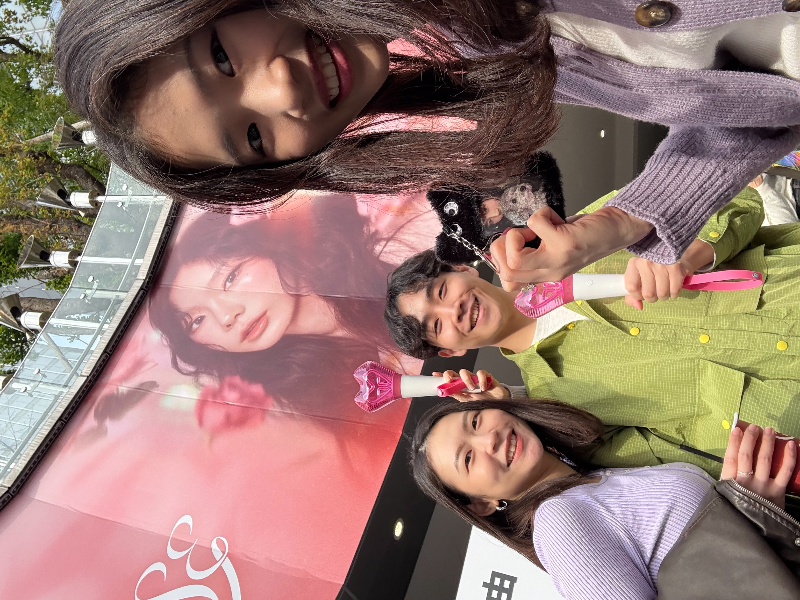

- Deadlifted 100kg!
  

## Things I like & Achievement:

- Attended Yi-Fan's favorite KPop singer Tayeon concert as a celebration to Yi-Fan's birthday
- Google interviews all passed: Hired/Lean Hired/Hired/Strong Hired, but BQ got Lean No Hired tho😂
- Had fit talk with Dublin's team for Software Engineer II, Network Modeling Infrastructure
- We took a helicopter flight in Aso in the family trip in North Kyushu
  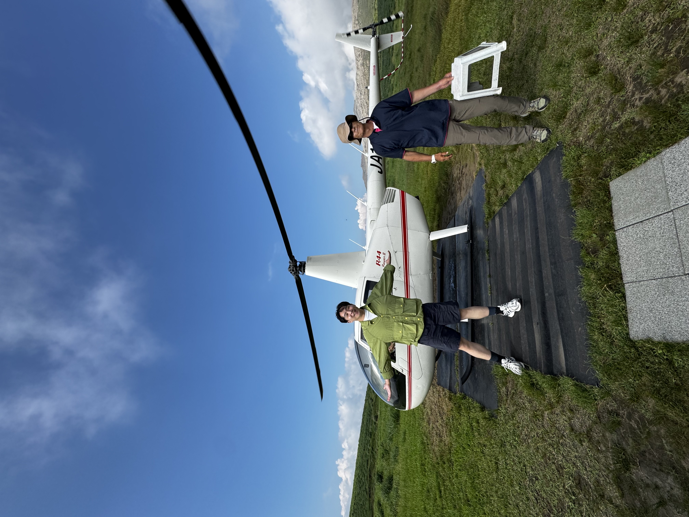
- got a free ticket to my favorite baseball team, Cheers <3
  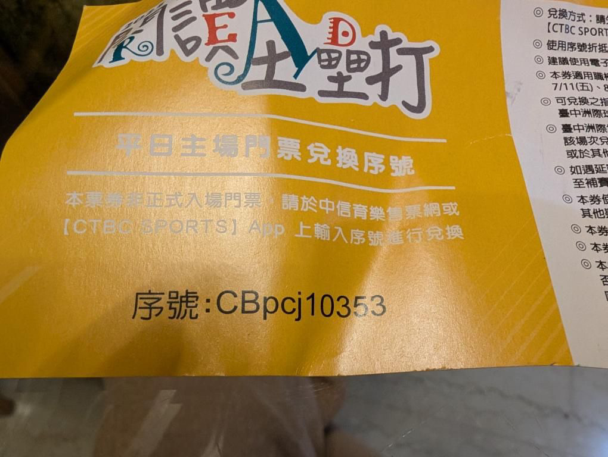

## Things I don’t like / Failed to do:

- Happiness comes with a price: I gained 4kg when prepping for Google, another 3kg in Toronto
- Knowing I’m leaving Trend Micro soon, even with the best of my efforts, I can’t stop myself cutting down devotions to work. The bottom line I set for myself is "當一天和尚, 敲一天鐘"
- Write anything, like when can I write a book?

## Books I read:

- 台灣漫遊錄 Taiwan Travelogue
- 進烤箱的好日子
  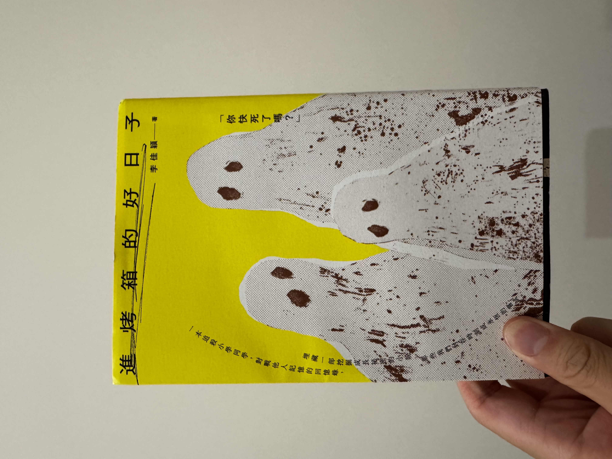
- 單車失竊記(WIP)
  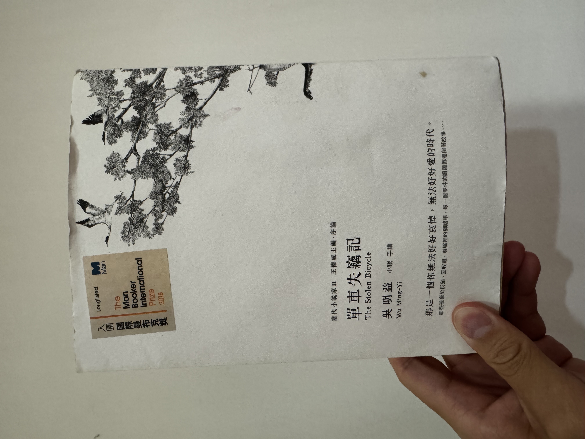

## TV Series/ Movies/ Anime I watched:

- 地, 關於地球的運動
- 柯南劇場版: 黑鐵的魚影
- 幕府將軍 Shogun
- 旺卡 by Timothée Chalamet
- Deadpool 2

## Tv series I watched with my partner Yi-Fan(Yvonne):

- Offline Love 離線找真愛(fav) [off line love](https://youtu.be/U8t492OLW3A?si=OFgnx3kL14PW8ejm)
- Resident Playbook 機智的住院醫生生活 [Hi Boyz Comeback Stage](https://youtu.be/b-OETU2uHM4?si=i6NUfR1xlZ0zNIJA)
- Devils Plan S2 魔鬼的計謀 S2: 尹紹熙對自己不夠有野心, 明明超級聰明的. 鄭泫揆是我無法祝福的冠軍
- 吞金(which is a terrible waste of time): 李載旭演的爛劇, Well, a man needs to eat and pay bills
- 交響情人夢
- Solo Inferno
- 海洋之心 2 海洋之心 2
- 照明商店
- 混沌少年時
- 正年
- Anurag Kashyap 誰偷了垃圾桶
- 母胎單身戀愛大作戰

## Cool Things I bought:

- super smooth & silent travel case
  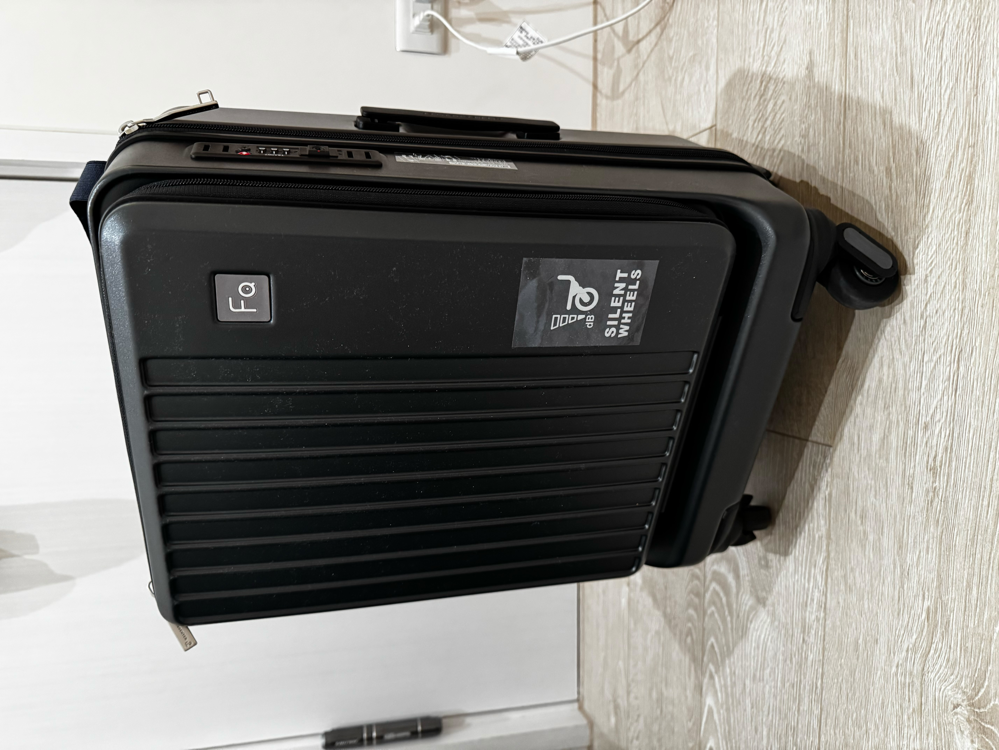
- Light green jacket
  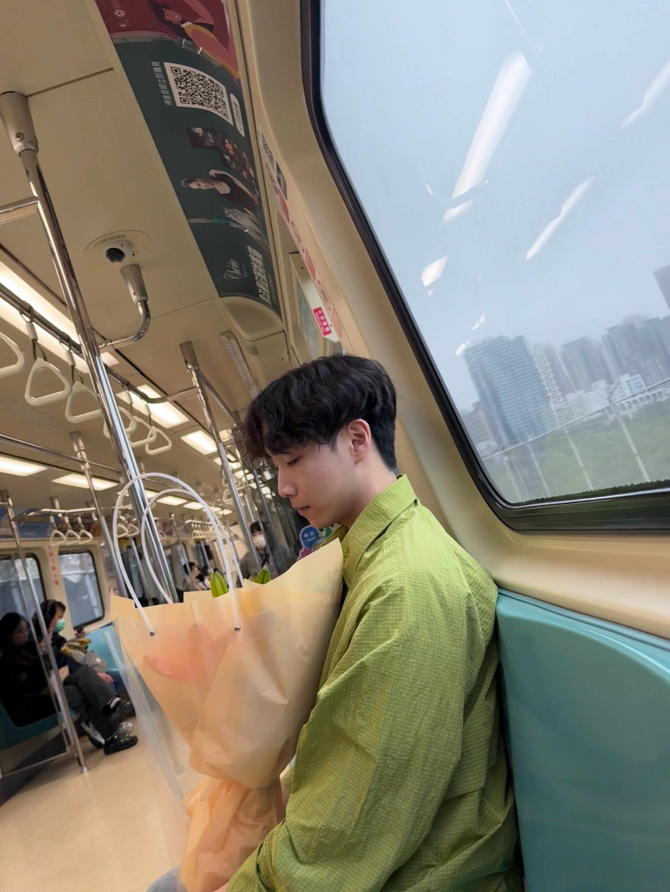
- Blue/Gray-ish Toronto Maple Leaf Jacket
  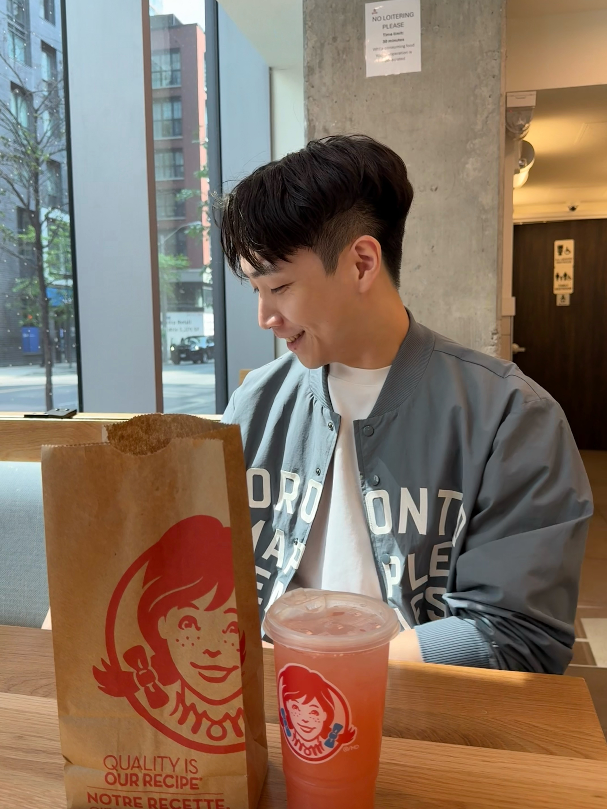
- Carhartt WIP, OG Detroit Jacket Blue/ Black rinsed-->my 2025 birthday gift from Yi-Fan
  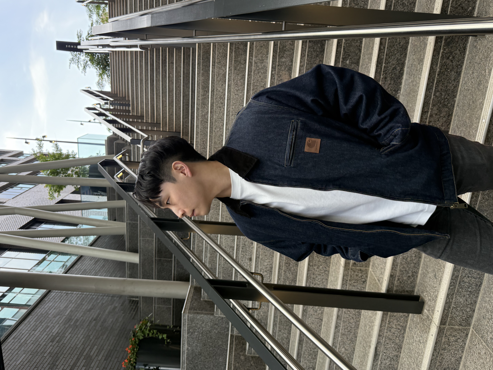
- Shiro Perfume Pomegranate
- Clarks Wallabes- Black Leather
  

## External Events

- 連署書& 誇誇團: 今年 2 月初, 台灣人民對被滲透的國會成員發動罷免. 身處中六選區, 現任立委是盧秀燕支持的羅廷瑋. 以奶爸形象當選, 但卻在國會全副武裝毆打他黨立委, 並且在罷免風潮當中, 變裝出席委員會, 試圖通過爭議法案. 我在第一時間就簽屬一階跟二階聯署書. 7/26 要進行最終的罷免投票, 大罷免大成功
  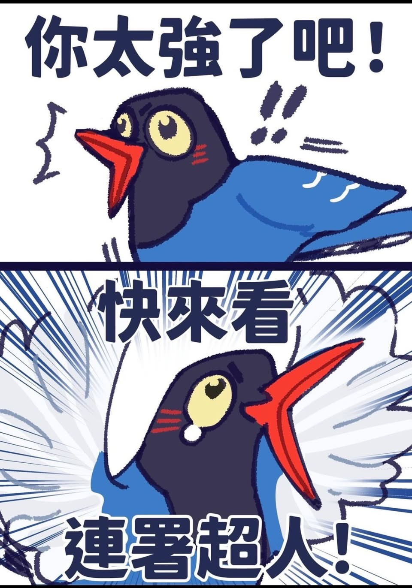
  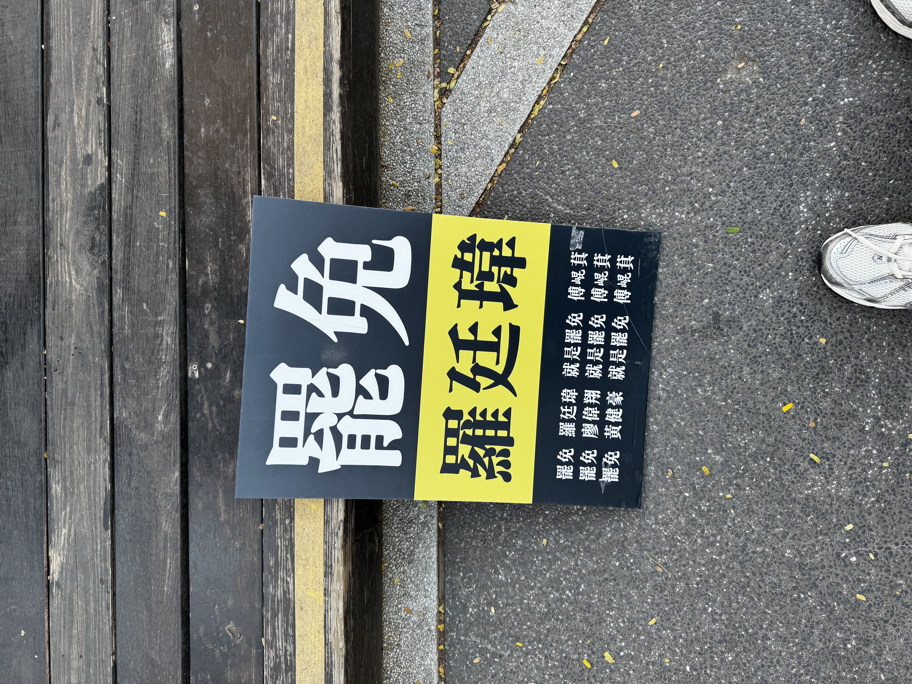
- Boston Celtics, after the Ace Jayson Tatum tore his achilles, got swept by New York Knicks. After the end of the season, to lower the team wage below 2nd apron, had no choice but to send away Jrue Holiday and Kristaps Porziņģis(Btw, NBA 2024-2025 Champion is Oklahoma Thunder)
- CTBC Brothers 中信兄弟, 在勝騎士因傷整季報銷, 德寶拉跟吳俊瑋因傷長期缺陣, 曾頌恩跟王威晨狀況不佳的情況下, 跟統一獅糾纏到上半季最後一場才痛失上半季冠軍.
- Trend Micro Reorg: Neil, the team lead is removed from the leader role. His team-- Cabybara is dismantle, and I'm moved to Slime Team.
- Grandma's hearing issue is getting worse. What's worse is, her shaking hands might suggest some kind of neuro deterioation

## Personal Trivia:

- 面對人生的不確定性, 開始會到東港鎮海宮蘇府七代巡網站線上求籤, 感謝賜籤
  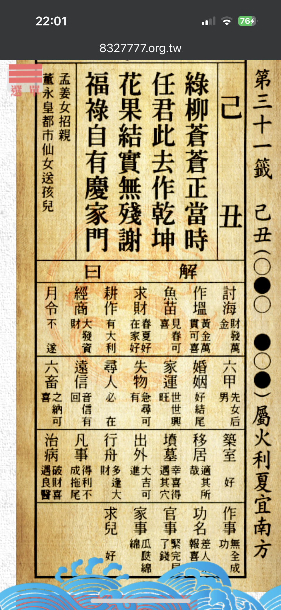
- 股市小白開啟定期定額, 感謝台灣經濟跟 Nvidia 的努力. 甚麼都沒做就賺 13%
- 開始認真的上教練課, 一周一次
- 長期借住黃大謙家, 一個晚上 300, 一周至少三天. 感謝他(2025 農曆年後至今)
  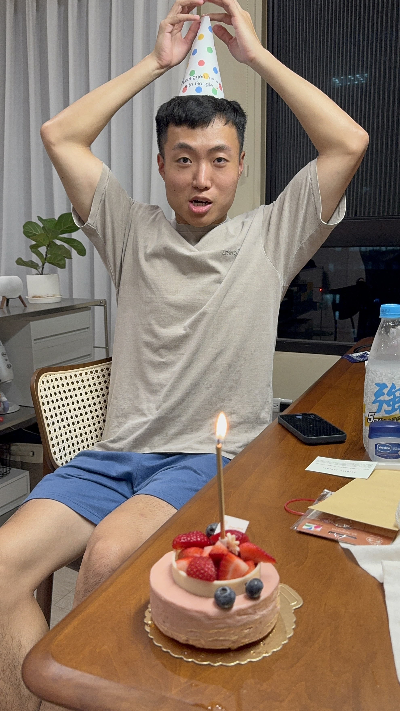
- 趁五月中去台南找陳毅, 睽違多年再次吃到台南永記虱目魚皮跟圓環牛肉湯, 好吃到老淚縱橫
  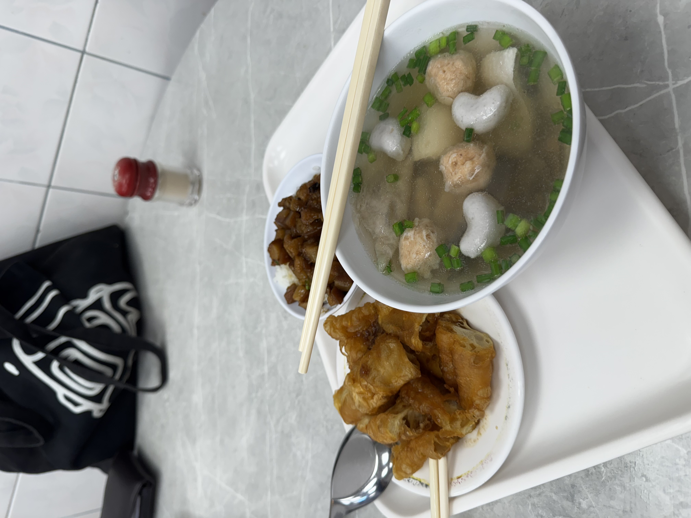
- 歲月催人老, 繼去年開始使用有潤色效果的防曬乳之後, 每天固定使用 innisfree 的綠茶精華液
- 台北台中兩地頻繁通勤的生活, 北車的寄物櫃已然成為我的生活必需品
  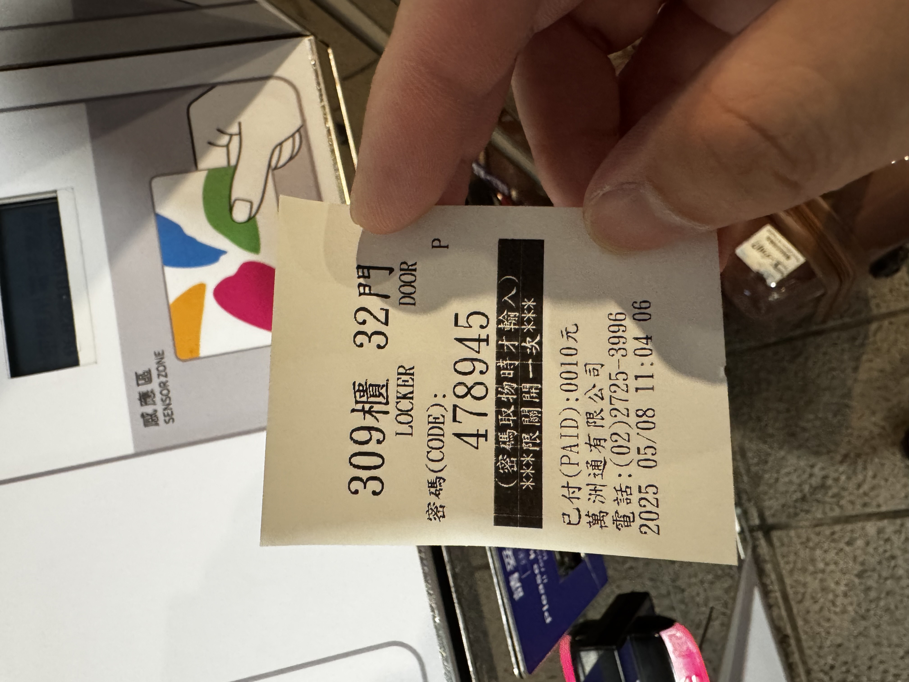
- 蘇怡帆創作蛇年貼圖, 可愛~
  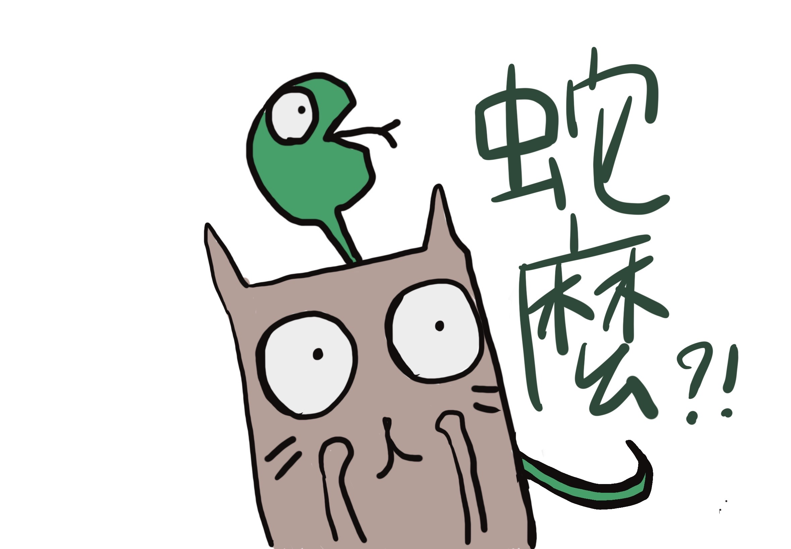

## Friends Status Updates:

- 睽違十年, 見到正在東京藝術大學努力做遊戲的胡琦, 依然是地表最酷的人類
  
- 陳毅終於考上公務員, 加入雲林縣政府觀光科(?)
  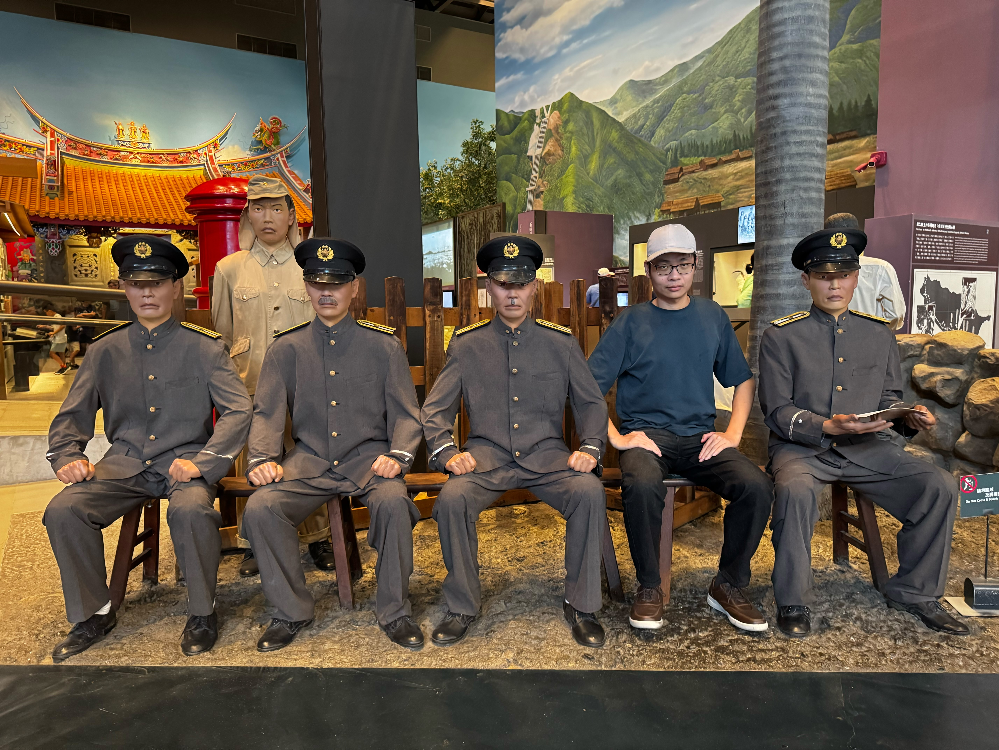
- 洪翊閔成為一個小時收費 1800, 一個月治療破 170 病人的酷酷物理治療師. 而且被室友告白兩次
  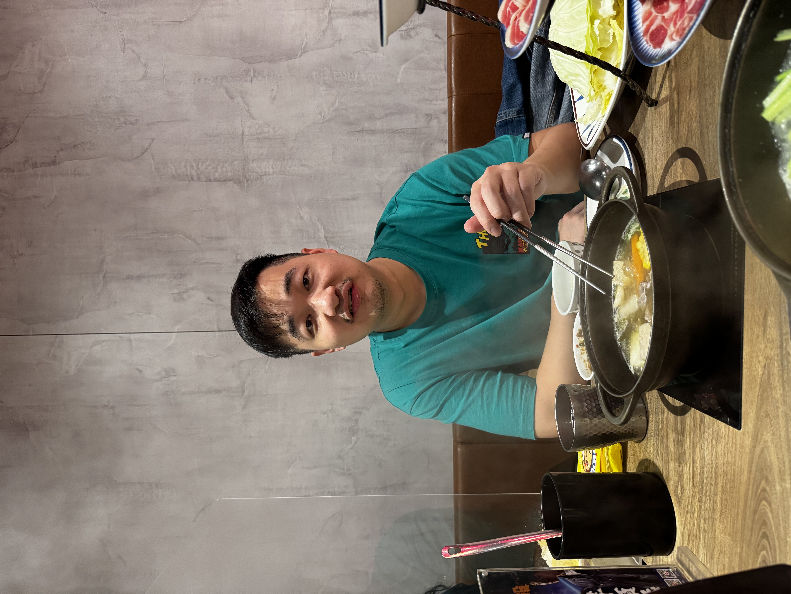
- 彭紹宇雖然嘴邊掛著即將出版的小說是醜媳婦總要見公婆, 但可以完成自己的小說就已經超棒的了
  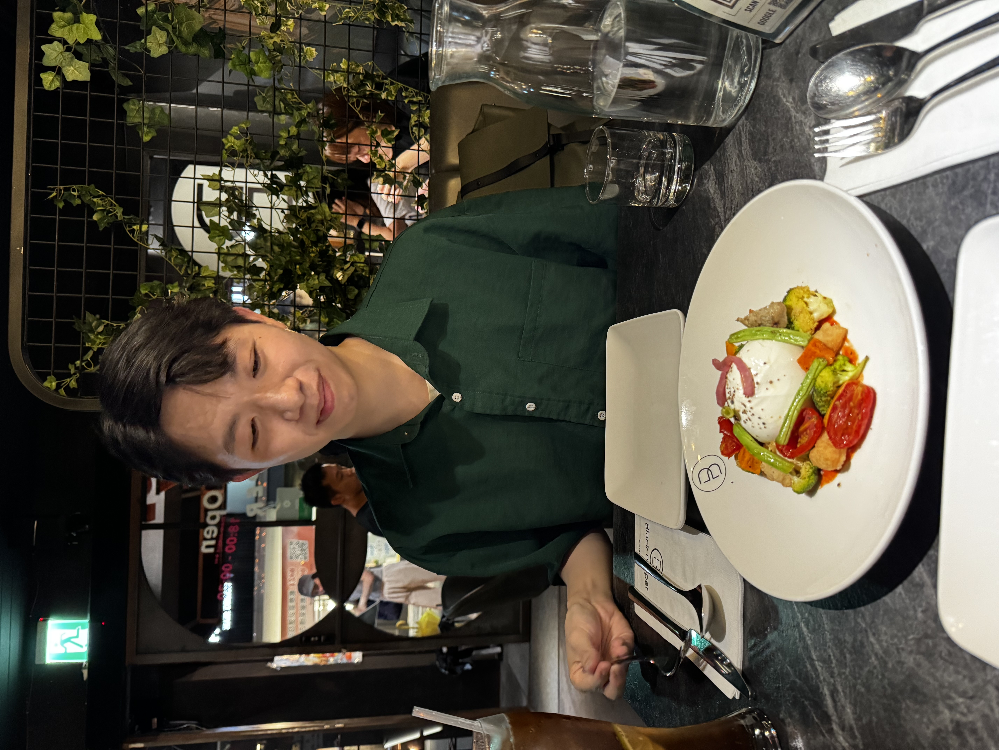
- 從去年十月為了陳柏安, 六魯成員全體宜蘭包棟民宿兩天一夜之後, 就再也沒有見過大家了 QQ
- 黃大謙出了一張很讚的專輯 [here's my fav](https://youtu.be/h1loJuo2k78?si=OzlVqncBUSmxIHdv)

## New friends:

- Andy from Google
- Jonathan from Google(but now in Aztec)
- Anabella Hsu from Google, Yi-Fan's friend
- Webber, the trainer from gym

## Thoughts and Takeways:

- 我或許不再是 E 人?: 隨著工作跟事業越來越花時間, 除了自身跟伴侶以外, 我能夠在乎的事情, 能夠跟朋友相處的時間越來越少. 每天下班後其實很享受一個人划手機或是跟 Yi-Fan 視訊
- 能夠完成就已經很了不起了: 長大後有很多事情太過困難, 不論用甚麼姿勢, 可以完成就已經很了不起了

## TODO:

- Learn how to co-work with some AI coding assistant, before it will replace me
- Detailed Financial Plan to get married. Yi-Fan and I will register as wife and husband, possibly in April 2026.
