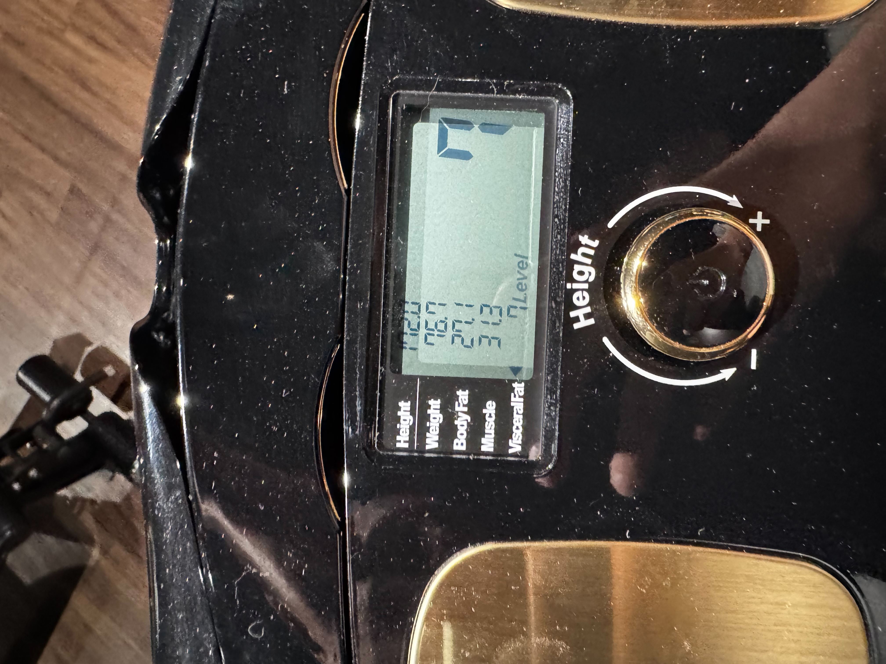

# 2025 2nd Half review

## Some Highlights:

## Things I don't like:
- As till July 2025, not a single thing went as I wanted. How Nice!
- Even though I've passed all the Google interview, I've encountered 2 major issues stopping me from quitting Trend Micro: 
    - Result of Googleyness interview is not ideal--Lean No Hire. I failed to find out the interviewer was trying to find out my coordination ability, not hearing me complain my incompetent team lead.
    - No vacancies in Dublin/ London/ Taipei: As the GenAI reshaping the software engineering industry, there are less vacancies for junior. Frustrating as it is, I still need to find a way to London. 

- 大罷免大失敗
- 作為大人的身不由己:成年之後, 縱使再努力, 也有太多太多的事情無法照我們想要的方向走eg. Google& 友情的維持-->Yi-Fan said she may not invite Savanna Chang, who, hands down used to be her best friend, to our planned proposal in Paris. And, eventually, we may only need inline website to book our wedding venue. Cuz only a dozen of people will be invited.

## Books I've read:
- 

## Career Development:
- Single handedly refactoring MyDashboard for Clean Aritecture. 
- Decided to pivot to GPU & C++ & CUDA & Low-Level Development, working on a side project(picking project theme)

## TV series/ Movie/ Anime I watched:
- 名偵探柯南20205電影版--獨眼的殘像
- F1 電影
- The Sandman(睡魔) S1 & S2
- The Residence(白色官邸殺人事件)
- Glass Heart玻璃之心: 佐藤健好帥, 菅田將暉好會唱
- 鬼滅之刃電影版, 無限城篇--猗窩座再襲: 猗窩座招式好華麗

## Tv series I watched with my partner Yi-Fan(Yvonne):
- 母胎單身大作戰
- 零日攻擊(expected)

## Thoughts
- 接近30歲, 開始覺得身體機能有在往下而感到焦慮. 具體事例包含: 代謝下降, 瘦身不易./ 一周至多兩練的肌肉成長速度不如預期. 

- Stop waiting for Google Team Match, moving on to prep for other companies. Good performance doesn't necessarily lead to good result. Besides, I only got Lean No Hire in Googleness Interview.